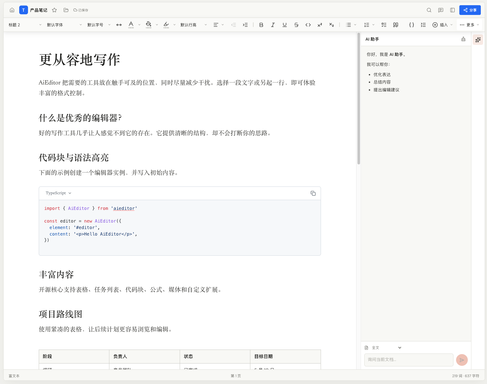

# AiEditor

## AI 驱动的下一代开源富文本编辑器

**AiEditor 是一个面向 AI 时代的下一代富文本编辑器。**

它将 **AI 能力、现代富文本编辑和专业文档能力** 深度融合，为开发者提供一个 **跨框架、跨设备、高度可配置、易于集成** 的编辑器基础。

AiEditor 基于 **Web Components** 构建，不绑定特定前端框架，可以轻松集成到 **Layui、Vue、React、Angular** 以及几乎任何 Web 前端项目中。

无论是构建 **AI 写作、知识库、企业文档、CMS、在线办公，还是合同、报告、方案等专业文档系统**，AiEditor 都可以作为核心编辑能力快速集成。

> **AI 原生 · 跨框架 · 跨设备 · 高度可配置 · 开源**

---

## ✨ 为什么选择 AiEditor？

### 🤖 AI 原生

AiEditor 从设计之初就面向 AI 场景，而不是在传统编辑器上简单增加一个 AI 按钮。

AI 可以直接参与文档创作和编辑：

* AI 对话
* AI 续写
* AI 改写
* AI 润色
* AI 校对
* AI 总结
* AI 翻译
* AI 内容生成
* AI 文档修改与优化

支持基于**全文、选区或独立问题**进行 AI 操作。


---

## 🌐 跨框架，一次开发，随处集成

AiEditor 基于 **Web Components** 构建，不依赖特定前端框架。

因此，你可以将它轻松集成到：

* Vue
* React
* Angular
* Layui
* 原生 JavaScript
* 以及其他支持 Web Components 的前端技术栈

```text
                         AiEditor
                            │
                     Web Components
                            │
        ┌───────────┬───────┼───────┬───────────┐
        │           │       │       │           │
       Vue        React   Angular  Layui     Vanilla JS
        │           │       │       │           │
        └───────────┴───────┼───────┴───────────┘
                            │
                     Your Application
```

**不绑定框架，让编辑器真正成为独立的基础能力。**

---

## 📱 PC 与 Mobile 全面适配

AiEditor 同时适配：

* 🖥️ PC Web
* 📱 手机 Web

针对不同屏幕尺寸提供自适应编辑体验，让同一个编辑器可以服务于桌面端和移动端业务。

同时提供：

* ☀️ 亮色主题
* 🌙 暗色主题

可以根据应用自身的 UI 风格进行配置和集成。

---

# 🚀 核心能力

## 📝 强大的富文本编辑

覆盖日常内容创作和企业文档所需的完整编辑能力：

* 标题、正文、字体、字号、颜色
* 段落样式
* 加粗、斜体、下划线、删除线
* 上标、下标、行内代码
* 有序列表、无序列表、任务列表
* 引用、分割线
* 对齐、缩进、行高、字间距
* 格式清除
* 链接、提及、Emoji
* 高亮内容块

---

## 📊 表格与专业内容

不仅可以写文章，也可以用于复杂业务文档。

* 表格插入
* 行列调整
* 单元格合并与拆分
* 代码块
* 多语言代码高亮
* 行内数学公式
* 块级数学公式
* 文档目录
* 标题大纲
* 文本统计


---

## 🖼️ 图片、音视频与附件

完整支持富媒体内容。

* 图片
* 音频
* 视频
* 文件附件
* 本地选择
* 拖拽上传
* 粘贴上传
* 图片尺寸调整
* 媒体对齐
* 图片说明文字
* YouTube、Twitch 等在线视频
* 上传进度
* 取消上传
* 文件类型限制
* 文件大小控制

---

## ⚡ 高效的编辑体验

围绕真实内容生产场景设计。

* 经典工具栏
* 紧凑工具栏
* Ribbon 工具栏
* 选区快捷菜单
* 内容上下文菜单
* 内容块拖拽
* 撤销与重做
* 全屏模式
* 只读模式
* Markdown 粘贴
* Word 粘贴
* 纯文本粘贴
* 快捷键支持
* PC / Mobile 自适应

---

## ⚙️ 灵活的配置与扩展

AiEditor 不要求你的产品适应编辑器，而是让编辑器适应你的产品。

提供灵活的配置能力，可以根据业务需求自由组合和调整编辑器功能。

开发者可以根据实际场景：

* 自定义工具栏
* 配置编辑器行为
* 控制功能开关
* 自定义主题
* 自定义语言
* 配置上传服务
* 接入不同 AI 服务
* 接入企业自有 AI 模型
* 扩展编辑器能力
* 与现有业务系统深度集成

因此，AiEditor 不只是一个“文章编辑器”，而是一个可以作为**业务基础设施**使用的编辑能力。

---


# 🎯 适用场景

AiEditor 可以作为各种内容型产品的编辑基础。

| 场景       | 应用                   |
| -------- | -------------------- |
| 🤖 AI 写作 | AI 写作、AI 审阅、AI 内容生成  |
| 📚 知识库   | 企业知识库、帮助中心、Wiki      |
| 🏢 企业应用  | OA、ERP、CRM、项目管理、业务后台 |
| 📰 内容平台  | CMS、博客、社区、资讯平台       |
| 📄 专业文档  | 合同、报告、方案、标书、业务文书     |
| 🎓 教育    | 教案、课程、作业、在线文档        |
| 🏛️ 政务   | 公文、政策文件、政务内容管理       |
| 🏥 医疗    | 病历、医疗报告、专业医疗文书       |

---

# 🧩 AiEditor 产品家族

AiEditor 不只是一个编辑器，而是一套面向不同业务场景的**文档编辑产品体系**。

## AiEditor

### 开源编辑器核心

面向通用场景的开源富文本编辑器。

提供：

**富文本 + AI + 表格 + 公式 + 媒体 + 主题 + 文档**

等核心能力。

适合开发者直接集成到自己的 Web 产品和业务系统。

---

## AiEditor Pro

### 面向商业文档产品

在 AiEditor 核心能力之上，提供更加专业的文档编辑能力。

适用于：

* 在线办公
* 合同
* 报告
* 方案
* 长文档
* 企业文档系统

提供分页等能力，让编辑体验更加接近传统办公文档。

---

## AiEditor Official

### 面向党政机关公文场景

针对党政机关公文写作和排版场景设计。

提供：

* 公文结构
* 公文排版
* GB/T 9704 相关规范
* 专业公文编辑能力

帮助政务系统快速构建专业的公文编辑能力。

---

## AiEditor Medical

### 面向医疗文书场景

针对医疗行业专业文档和业务系统设计。

适用于：

* 病历
* 医疗报告
* 医疗文书
* 医疗业务系统

为医疗信息化产品提供专业的文档编辑能力。

---


# 🔗 在线体验

### 官方网站

https://aieditor.com.cn

### 在线 Demo

https://aieditor.com.cn/zh/demo

### 开源仓库

https://gitee.com/aieditor-team/aieditor

---

# ❤️ 开源

AiEditor 是一个开源项目。

如果 AiEditor 对你的项目有帮助，欢迎：

* ⭐ Star 项目
* 🐛 提交 Issue
* 🔧 提交 Pull Request
* 💬 参与社区讨论
* 📢 推荐给更多开发者

**让更多产品拥有更好的 AI 编辑体验。**

---

# License

AiEditor 使用开源协议发布。

具体协议及商业授权方式，请参考项目仓库中的 License 文件。
