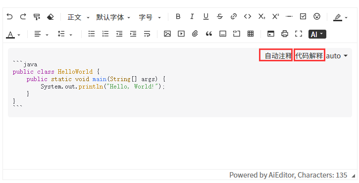

# Code Block AI Configuration

In the code editor component, there are two AI functionalities related to  `"AI automatic comment insertion" ` and `"AI code interpretation" `. As shown in the following image:



## Sample

The above functions need to be configured for AI, and the configuration code is as follows:

```typescript
new AiEditor({
    element: "#aiEditor",
    ai:{
        codeBlock: {
            codeComments: {
                model:"spark",
                prompt:"Help me add some comments to this code, and return the code with comments added. Only return the code.",
            },
            codeExplain: {
                model:"spark",
                prompt:"Help me explain this code, providing an explanation of what the code does. Note that there's no need to explain the comments in the code.",
            }
        }
    },
})
```

- model: Refers to which large model to use.
- prompt: The prompt content for the large model.