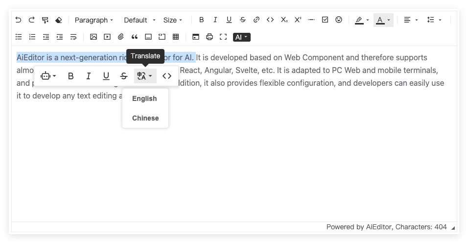

# AI translation function configuration

AI translation means that after selecting a text, you can translate its content. As shown in the figure below:



## Sample code

If we need to configure the default translation language, the configuration code is as follows:

```typescript
new AiEditor({
    element: "#aiEditor",
    ai: {
        translate: {
            prompt: (lang, selectedText) => {
                return `Please help me translate the following content into: ${lang}, and return the translation result. The content you need to translate is:\n${selectedText}`
            },
            translateMenuItems: [
                {title: 'English', language:'English'},
                {title: 'Chinese'},
            ],
        }
    },
})
```

- **prompt**: prompt content of the large model
- **translateMenuItem - title**: content used to display in the menu
- **translateMenuItem - language**: the value of `lang` passed to the `prompt()` method. When not configured, the value of `title` is used by default.