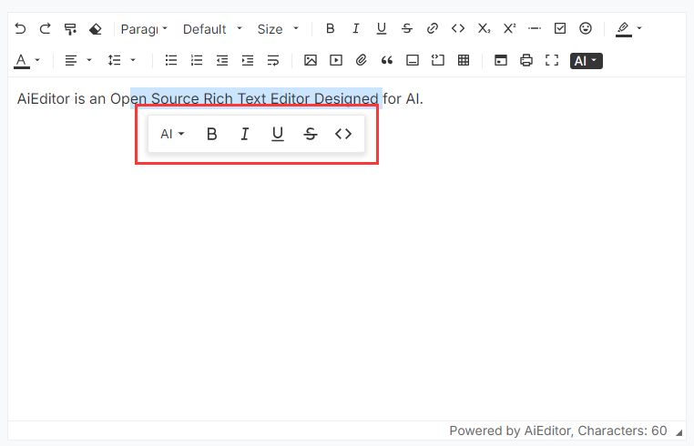

# Bubble menu

The bubble menu refers to the UI menu that pops up when the user selects a piece of text, as shown in the figure below:


## Menu configuration

In AIEditor, we can configure the bubble menu through `textSelectionBubbleMenu`, the sample code is as follows:

```typescript
new AiEditor({
    element: "#aiEditor",
    content: 'AiEditor is an open source rich text editor for AI.',
    textSelectionBubbleMenu: {
        enable: true,
        items: ["ai", "Bold", "Italic", "Underline", "Strike", "code", "comment"],
    },
})
```

- **enable**: Whether to enable the bubble menu
- **items**: Menu items of the bubble menu (configuration is not case-sensitive)


>Note: The configuration of "comments" for the above ** items ** is only supported in the Pro version (not currently supported in the open source version).


## Customize Bubble menus

You can use the above **items**, just pass in a `BubbleMenuItem` configuration, the sample code is as follows:

```ts
new AiEditor({
    element: "#aiEditor",
    placeholder: "Click to enter content...",
    content: 'AiEditor is an open source rich text editor for AI.',
    textSelectionBubbleMenu: {
        enable: true,
        items: ["ai", "Bold", "Italic", {
            id: "visit",
            title: "visit-link",
            icon: "<svg xmlns=\"http://www.w3.org/2000/svg\" viewBox=\"0 0 24 24\"><path d=\"M10 6V8H5V19H16V14H18V20C18 20.5523 17.5523 21 17 21H4C3.44772 21 3 20.5523 3 20V7C3 6.44772 3.44772 6 4 6H10ZM21 3V11H19L18.9999 6.413L11.2071 14.2071L9.79289 12.7929L17.5849 5H13V3H21Z\"></path></svg>",
            onClick: (editor) => {
                window.open("https://aieditor.dev", "_blank")
            }
        }],
    },
})
```

`BubbleMenuItem` Configuration Instructions:
- **id**: The ID of the current menu item, globally unique,
- **title**: The title displayed when the mouse moves over it, supports international configuration. For internationalization configuration, refer to the [Internationalization](./i18n.md) section.
- **icon**: The icon or html content of the menu item. It is recommended to use the icon under https://remixicon.com, which is consistent with AIEditor.
- **onClick**: Listen for click events


## AI Bubble menus 💪

AI floating menu is only supported in the `Pro Version`. After clicking the configured floating menu, the AI ​​dialogue content will pop up directly.

Its configuration is as follows:

```ts
new AiEditor({
    element: "#aiEditor",
    placeholder: "Click to enter content...",
    content: 'AiEditor is an open source rich text editor for AI.',
    textSelectionBubbleMenu: {
        enable: true,
        items: ["ai", "Bold", "Italic", {
            id:"translate",
            icon:"<svg ....></svg>   ",
            type:"ai",
            prompt:"Help me translate the following content into English: {content}"
        }],
    },
})
```
> Note: In the above configuration, `type: "ai"` is a fixed value and cannot be changed to other content, otherwise it will conflict with `Customize Bubble menus`.
