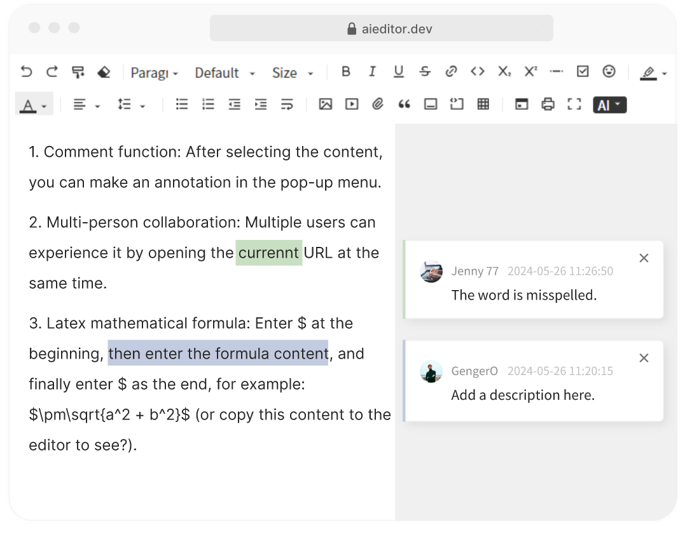

#  Comment

The annotate function is similar to the annotate function of Word, you can select a text alignment to comment, as shown in the following figure:



>PS: This feature is only available in the Pro version (commercial version) and not in the open source version. Pro version preview address: http://pro.aieditor.com.cn
## How to Use

```typescript
new AiEditor({
    element: "#aiEditor",
    comment: {
        enable: true,
        floatable: false,
        enableWithEditDisable: true,
        onCommentActivated: (commentIds) => {
            // When the comment area gets focus
        },

        queryAllComments: () => {
            // Query all comments of the current document and return CommentInfo[] or Promise<CommentInfo[]>
        },

        queryMyComments: () => {
            // Query "My Comments", return CommentInfo[] or Promise<CommentInfo[]>
        },

        queryCommentsByIds: (commentIds) => {
            // Query multiple comments based on multiple document IDs and return CommentInfo[] or Promise<CommentInfo[]>
        },

        onCommentCreate: (commentId, content, commentPid) => {
            // When a comment is created, returns CommentInfo or Promise<CommentInfo>
        },

        onCommentDelete: (commentId) => {
            // When the comment is deleted, returns boolean or Promise<boolean>;
        },
    },
})
```

- **enable**: Whether to enable the comment function
- **floatable**: Whether the content of the comment is floating with the position of the comment area
- **enableWithEditDisable**: Whether to enable the annotation (comment) function in read-only mode, the default is false
- **onCommentActivated**: This callback is triggered when the comment gains focus
- **onCommentCreate**: Listen for comments to be created. At this time, we should save the comment content to the database and return the complete comment information
- **onCommentDelete**: Listen for comments to be deleted. At this time, the comments in the database should be deleted synchronously
- **queryAllComments**: Query all comments (when the configuration `floatable: false` is valid)
- **queryMyComments**: Query my comments (when the configuration `floatable: false` is valid)
- **queryCommentsByIds**: Query all comments based on multiple comment ids (when the configuration `floatable: true` is valid)


## Sample code

The following example code uses LocalStorage to save the comment content

```typescript
const colors = ['#3f3f3f', '#938953', '#548dd4', '#95b3d7',
    '#d99694', '#c3d69b', '#b2a2c7', '#92cddc', '#fac08f'];
new AiEditor({
    element: "#aiEditor",
    comment: {
        enable: true,
        floatable: false,
        enableWithEditDisable: true,
        onCommentActivated: (_commentId) => {
            // console.log("onCommentActivated---->", commentId)
        },

        queryAllComments: () => {
            const allCommentsString = localStorage.getItem("all-comments");
            const allCommentIds = allCommentsString ? JSON.parse(allCommentsString) : [];
            const allComments = [] as any[];
            allCommentIds.forEach((commentId: any) => {
                const contentJSON = localStorage.getItem(commentId);
                if (contentJSON) allComments.push(JSON.parse(contentJSON));
            })
            return allComments;
        },

        queryCommentsByIds: (commentIds) => {
            const allComments = [] as any[];
            if (commentIds) commentIds.forEach((commentId: any) => {
                const contentJSON = localStorage.getItem("comment-" + commentId);
                if (contentJSON) allComments.push(JSON.parse(contentJSON));
            })
            return allComments;
        },


        onCommentCreate: (commentId, content, commentPid) => {
            const comment = {
                id: commentId,
                pid: commentPid,
                account: "michael",
                avatar: Math.floor(Math.random() * 10) > 3 ? "https://aieditor.dev/assets/image/logo.png" : undefined,
                mainColor: colors[Math.floor(Math.random() * colors.length)],
                createdAt: "2024-05-26 10:23:56",
                content
            } as CommentInfo;

            localStorage.setItem("comment-" + commentId, JSON.stringify(comment));

            const allCommentsString = localStorage.getItem("all-comments");
            const allComments = allCommentsString ? JSON.parse(allCommentsString) : [];

            if (commentPid) {
                const parentCommentJSON = localStorage.getItem("comment-" + commentPid);
                if (parentCommentJSON) {
                    const parentComment = JSON.parse(parentCommentJSON);
                    if (parentComment.children) {
                        parentComment.children.unshift(comment)
                    } else {
                        parentComment.children = [comment]
                    }
                    localStorage.setItem("comment-" + commentPid, JSON.stringify(parentComment));
                }
            } else {
                allComments.push("comment-" + commentId)
            }


            localStorage.setItem("all-comments", JSON.stringify(allComments));

            return new Promise((resolve) => {
                resolve(comment)
            })
        },

        onCommentDelete: (commentId) => {
            localStorage.removeItem("comment-" + commentId);
            return true;
        },
    },
})
```


**CommentInfo** Description of the comment information

- id: indicates the comment id, which is globally unique
- pid: the parent id of the comment
- account: The account or nickname of the comment
- avatar: indicates the URL of the user profile picture
- mainColor: background color of the comment text
- createdAt: Comment time
- content: Comment content
