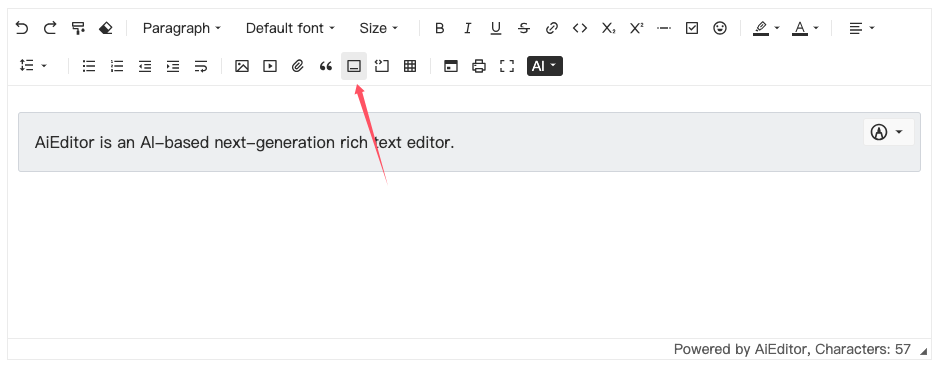

# Highlight block container

Highlight block container comes from the extended syntax of Markdown `:::`, for example

```markdown
::: warning
This is a warning.
:::
```
The display content is as follows:

::: warning  This is a warning.

:::


In AIEditor, we can directly input `:::warning` and then press Enter to add a highlight block container. Or we can add it by clicking the toolbar button, as shown below:



In AIEditor, there are three built-in highlight block containers: `info`, `warning`, and `danger`.

## Default highlight block configuration

Default highlight block configuration is the type of highlight block used when clicking the highlight block icon in the `toolbar`. 
Or when the user only enters `:::` and then presses the Enter key, the default type is used.


```typescript
new AiEditor({
    element: "#aiEditor",
    container: {
        defaultTypeName: "warning",
    }
})
```

The default setting is to use the "warning" type.

## Custom highlight block container

Users can make more configurations through the following code:

```typescript
new AiEditor({
    element: "#aiEditor",
    container: {
        typeItems: [
            {
                name: "default",
                lightBgColor: "#fafafa",
                lightBorderColor: "#e0e0e0",
                darkBgColor: "#1e1e1e",
                darkBorderColor: "#303030",
            },
            {
                name: 'info',
                lightBgColor: '#eff1f3',
                lightBorderColor: '#D7DAE0',
                darkBgColor: '#2a2c30',
                darkBorderColor: '#333',
            },
            {
                name: 'warning',
                lightBgColor: '#fcf5e4',
                lightBorderColor: '#D7DAE0',
                darkBgColor: '#40361d',
                darkBorderColor: '#333',
            },
            {
                name: 'danger',
                lightBgColor: '#ffe7ea',
                lightBorderColor: '#D7DAE0',
                darkBgColor: '#46222a',
                darkBorderColor: '#333',
            },
        ]
    },
})
```
In the above code, 4 types of highlight blocks are configured, namely `default`, `info`, `warning`, and `danger`. 
At this time, we enter `:::default` and then press Enter to add a highlight block of the `default` type.

The configuration item `typeItems` is an array, each element in the array is an object, and the object contains the following fields:
- name: The name of the highlight block, used to distinguish different highlight blocks, must be unique and cannot be empty.
- lightBgColor: The background color of the highlight block, displayed in light theme.
- lightBorderColor: The border color of the highlight block, displayed in light theme.
- darkBgColor: The background color of the highlight block, displayed in dark theme.
- darkBorderColor: The border color of the highlight block, displayed in dark theme.

## Other things

When using the `aieditor.getMarkdown()` method to get Markdown content, AIEditor will automatically convert the highlighted block to Markdown syntax.

For example:

```markdown
::: warning
This is a warning.
:::
```

