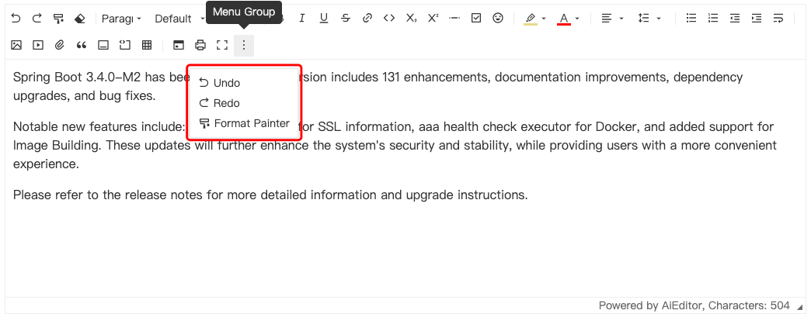

# Toolbar configuration

## Samples

```typescript
new AiEditor({
    element: "#aiEditor",
    toolbarKeys: ["undo", "redo", "brush", "eraser", 
        "|", "heading", "font-family", "font-size", 
        "|", "bold", "italic", "underline", "strike", "link", "code", "subscript", "superscript", "hr", "todo", "emoji", 
        "|", "highlight", "font-color",
        "|", "align", "line-height", 
        "|", "bullet-list", "ordered-list", "indent-decrease", "indent-increase", "break", 
        "|", "image", "video", "attachment", "quote", "code-block", "table", 
        "|", "source-code", "printer", "fullscreen", "ai"
    ],
})
```

The above configuration is the default configuration of the AiEditor tool class, which `"|"` represents the dividing line.


## Exclude some tools

Configure `toolbarExcludeKeys` to exclude the initialization of some tools. The sample code is as follows:

```typescript
new AiEditor({
    element: "#aiEditor",
    toolbarExcludeKeys: ["heading", "font-family", "font-size", "ai"],
})
```


## Customize toolbar

In AiEditor, we can customize the extension of the toolbar by making a custom in the `toolbarKeys` configuration, and the configuration sample code is as follows:

```typescript 7-12
new AiEditor({
    element: "#aiEditor",
    toolbarKeys: ["undo", "redo", "brush", "eraser",
        "|", "heading", "font-family", "font-size",
        "|",
        {
            icon: "<svg .....>",
            html:"<div ...>",
            onClick: (event, editor) => {
                //Click Event
            },
            tip: "Mouseover Tooltip Content",
        },
        "printer", "fullscreen", "ai"
    ],
})
```
Description of custom tool configuration items:

- **icon**: The icon used for menu display, only svg configuration is supported for the time being, and it is recommended to use the icon provided by https://remixicon.com to ensure that the icon style of AiEditor is consistent.

- **HTML**: Customize the HTML content of the menu, this configuration will override the icon configuration, causing the icon not to take effect, `icon` and `html` only one of them can be configured.

- **onClick**: Listens for events in the mouse click menu.

- **tip**: Mouse over the text prompt displayed in the menu, which supports internationalization configuration.


**TIP internationalization configuration sample code**

```ts 12,18,21
new AiEditor({
    element: "#aiEditor",
    toolbarKeys: ["undo", "redo", "brush", "eraser",
        "|", "heading", "font-family", "font-size",
        "|",
        {
            icon: "<svg .....>",
            html:"<div ...>",
            onClick: (event, editor) => {
                //Click Event
            },
            tip: "myKey",
        },
        "printer", "fullscreen", "ai"
    ],
   i18n: {
        zh :{
            "myKey": "自定义国际化显示中文内容",
        },
        en:{
            "myKey": "Custom your i18n content",
        }
    }
})
```


## Toolbar Grouping

Toolbar grouping means that some tools can be classified into a group, and the menu content will pop up by clicking the group button. As shown in the figure below:



The configuration code is as follows:

```typescript 11-15
new AiEditor({
    element: "#aiEditor",
    toolbarKeys: ["undo", "redo", "brush", "eraser", 
        "|", "heading", "font-family", "font-size", 
        "|", "bold", "italic", "underline", "strike", "link", "code", "subscript", "superscript", "hr", "todo", "emoji", 
        "|", "highlight", "font-color",
        "|", "align", "line-height", 
        "|", "bullet-list", "ordered-list", "indent-decrease", "indent-increase", "break", 
        "|", "image", "video", "attachment", "quote", "code-block", "table", 
        "|", "source-code", "printer", "fullscreen", "ai",
        {
            // title:"menu group",
            // icon:`<svg.... />`,
            toolbarKeys:["undo", "redo", "brush" ]
        }
    ],
})
```

As shown above, by configuring a `MenuGroup` object in `toolbarKeys`, you can group menus.

`MenuGroup` supports the following configurations:

- **title**: (optional) The content displayed by default when the mouse moves over it
- **icon**: (optional) The icon of the group button
- **toolbarKeys**: (required) The menu keys of the group

**Advanced usage: Customize menus in toolbar groups**

In the menu group, add a customized menu button. The sample code is as follows:

```typescript 15-22
new AiEditor({
    element: "#aiEditor",
    toolbarKeys: ["undo", "redo", "brush", "eraser", 
        "|", "heading", "font-family", "font-size", 
        "|", "bold", "italic", "underline", "strike", "link", "code", "subscript", "superscript", "hr", "todo", "emoji", 
        "|", "highlight", "font-color",
        "|", "align", "line-height", 
        "|", "bullet-list", "ordered-list", "indent-decrease", "indent-increase", "break", 
        "|", "image", "video", "attachment", "quote", "code-block", "table", 
        "|", "source-code", "printer", "fullscreen", "ai",
        {
            // title:"menu group",
            // icon:`<svg.... />`,
            toolbarKeys:["undo", "redo", "brush",
                {
                    icon: "<svg .....>",
                    html:"<div ...>",
                    onClick: (event, editor) => {
                        //点击事件
                    },
                    tip: "myKey",
                },
            ]
        }
    ],
})
```

For its specific meaning, please refer to: [#Customize toolbar](#customize-toolbar)
