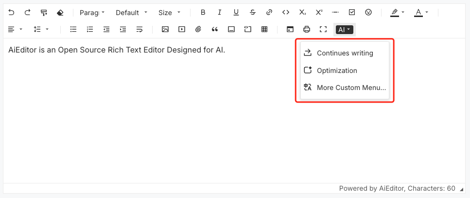
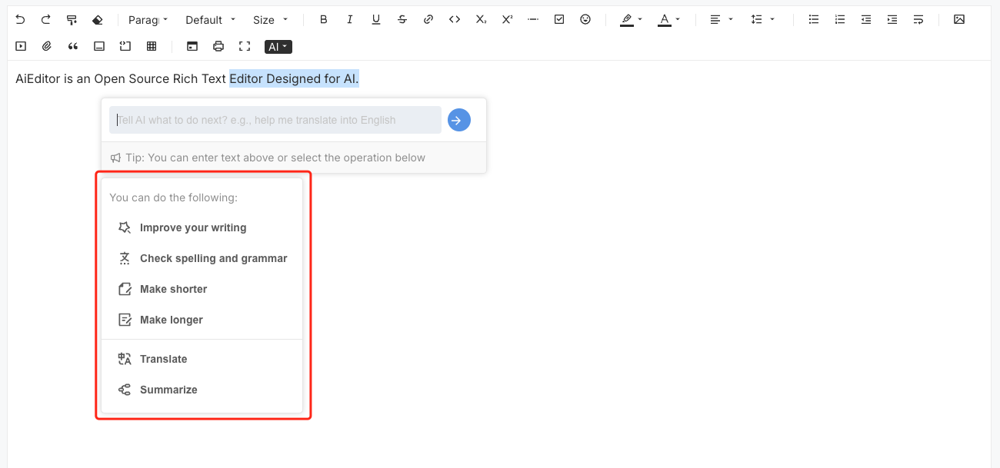

# AI 菜单配置

AI 菜单配置，用于在编辑器顶部工具栏，点击 AI 下拉的菜单内容，以及当选中文字后，弹出的 AI 泡泡菜单里的 AI 选项内容。

## 工具栏菜单



工具栏菜单配置示例代码

```typescript
new AiEditor({
    element: "#aiEditor",
    ai:{
        // models:{...] 等其他配置
        menus:[
            {
                icon: `<svg xmlns="http://www.w3.org/2000/svg" viewBox="0 0 24 24"><path fill="none" d="M0 0h24v24H0z"></path><path d="M4 18.9997H20V13.9997H22V19.9997C22 20.552 21.5523 20.9997 21 20.9997H3C2.44772 20.9997 2 20.552 2 19.9997V13.9997H4V18.9997ZM16.1716 6.9997L12.2218 3.04996L13.636 1.63574L20 7.9997L13.636 14.3637L12.2218 12.9495L16.1716 8.9997H5V6.9997H16.1716Z"></path></svg>`,
                name: "AI 续写",
                prompt: "请帮我继续扩展一些这段话的内容",
                text: "focusBefore",
                model:"auto",
            },
            {
                icon: `<svg xmlns="http://www.w3.org/2000/svg" viewBox="0 0 24 24"><path fill="none" d="M0 0h24v24H0z"></path><path d="M15 5.25C16.7949 5.25 18.25 3.79493 18.25 2H19.75C19.75 3.79493 21.2051 5.25 23 5.25V6.75C21.2051 6.75 19.75 8.20507 19.75 10H18.25C18.25 8.20507 16.7949 6.75 15 6.75V5.25ZM4 7C4 5.89543 4.89543 5 6 5H13V3H6C3.79086 3 2 4.79086 2 7V17C2 19.2091 3.79086 21 6 21H18C20.2091 21 22 19.2091 22 17V12H20V17C20 18.1046 19.1046 19 18 19H6C4.89543 19 4 18.1046 4 17V7Z"></path></svg>`,
                name: "AI 优化",
                prompt: "请帮我优化一下这段文字的内容，并返回结果",
                text: "selected",
                model:"auto",
            },
        ]
    },
})
```

- **icon**：用于菜单显示的 icon，暂时只支持 svg 配置，svg icon 建议使用 https://remixicon.com 提供的 icon，以保证和 AiEditor 的 icon 风格保持统一。
- **name**：AI 菜单的名称
- **prompt**：AI 提示语
- **text**：文字内容，支持 `"focusBefore"` 和 `"selected"` 可选；`"focusBefore"` 表示获取当前焦点前的文字内容，`"selected"` 表示获取当前选中的文本内容。
- **model**：使用的 AI 大模型，目前支持 `spark` (星火大模型)、`wenxin`（文心一言）以及 `custom`（自定义类型），来未来会支持文心一言、ChatGPT 等多模型共存。

**注意：** 当 `model` 未配置，或者配置为 "`auto`" 时，会自动选择第一个配置的大语言模型。


## 泡泡菜单



配置实例代码：


```typescript
new AiEditor({
    element: "#aiEditor",
    ai:{
        // models:{...] 等其他配置
        bubblePanelMenus:[
            {
                prompt: `<content>{content}</content>\n请帮我优化一下这段内容，并直接返回优化后的结果。\n注意：你应该先判断一下这句话是中文还是英文，如果是中文，请给我返回中文的内容，如果是英文，请给我返回英文内容，只需要返回内容即可，不需要告知我是中文还是英文。`,
                icon: `<svg xmlns="http://www.w3.org/2000/svg" viewBox="0 0 24 24" fill="currentColor"><path d="M15.1986 9.94447C14.7649 9.5337 14.4859 8.98613 14.4085 8.39384L14.0056 5.31138L11.275 6.79724C10.7503 7.08274 10.1433 7.17888 9.55608 7.06948L6.49998 6.50015L7.06931 9.55625C7.17871 10.1435 7.08257 10.7505 6.79707 11.2751L5.31121 14.0057L8.39367 14.4086C8.98596 14.4861 9.53353 14.7651 9.94431 15.1987L12.0821 17.4557L13.4178 14.6486C13.6745 14.1092 14.109 13.6747 14.6484 13.418L17.4555 12.0823L15.1986 9.94447ZM15.2238 15.5079L13.0111 20.1581C12.8687 20.4573 12.5107 20.5844 12.2115 20.442C12.1448 20.4103 12.0845 20.3665 12.0337 20.3129L8.49229 16.5741C8.39749 16.474 8.27113 16.4096 8.13445 16.3918L3.02816 15.7243C2.69958 15.6814 2.46804 15.3802 2.51099 15.0516C2.52056 14.9784 2.54359 14.9075 2.5789 14.8426L5.04031 10.3192C5.1062 10.1981 5.12839 10.058 5.10314 9.92253L4.16 4.85991C4.09931 4.53414 4.3142 4.22086 4.63997 4.16017C4.7126 4.14664 4.78711 4.14664 4.85974 4.16017L9.92237 5.10331C10.0579 5.12855 10.198 5.10637 10.319 5.04048L14.8424 2.57907C15.1335 2.42068 15.4979 2.52825 15.6562 2.81931C15.6916 2.88421 15.7146 2.95507 15.7241 3.02833L16.3916 8.13462C16.4095 8.2713 16.4739 8.39766 16.5739 8.49245L20.3127 12.0338C20.5533 12.2617 20.5636 12.6415 20.3357 12.8821C20.2849 12.9357 20.2246 12.9795 20.1579 13.0112L15.5078 15.224C15.3833 15.2832 15.283 15.3835 15.2238 15.5079ZM16.0206 17.435L17.4348 16.0208L21.6775 20.2634L20.2633 21.6776L16.0206 17.435Z"></path></svg>`,
                title: 'improve-writing',
            },
            {
                prompt: `<content>{content}</content>\n请帮我检查一下这段内容，是否有拼写错误或者语法上的错误。\n注意：你应该先判断一下这句话是中文还是英文，如果是中文，请给我返回中文的内容，如果是英文，请给我返回英文内容，只需要返回内容即可，不需要告知我是中文还是英文。`,
                icon: ` <svg xmlns="http://www.w3.org/2000/svg" viewBox="0 0 24 24" fill="currentColor"><path d="M12 19C12.8284 19 13.5 19.6716 13.5 20.5C13.5 21.3284 12.8284 22 12 22C11.1716 22 10.5 21.3284 10.5 20.5C10.5 19.6716 11.1716 19 12 19ZM6.5 19C7.32843 19 8 19.6716 8 20.5C8 21.3284 7.32843 22 6.5 22C5.67157 22 5 21.3284 5 20.5C5 19.6716 5.67157 19 6.5 19ZM17.5 19C18.3284 19 19 19.6716 19 20.5C19 21.3284 18.3284 22 17.5 22C16.6716 22 16 21.3284 16 20.5C16 19.6716 16.6716 19 17.5 19ZM13 2V4H19V6L17.0322 6.0006C16.2423 8.3666 14.9984 10.5065 13.4107 12.302C14.9544 13.6737 16.7616 14.7204 18.7379 15.3443L18.2017 17.2736C15.8917 16.5557 13.787 15.3326 12.0005 13.7257C10.214 15.332 8.10914 16.5553 5.79891 17.2734L5.26257 15.3442C7.2385 14.7203 9.04543 13.6737 10.5904 12.3021C9.46307 11.0285 8.50916 9.58052 7.76789 8.00128L10.0074 8.00137C10.5706 9.03952 11.2401 10.0037 11.9998 10.8772C13.2283 9.46508 14.2205 7.81616 14.9095 6.00101L5 6V4H11V2H13Z"></path></svg>`,
                title: 'check-spelling-and-grammar',
            },
            '<hr/>',
            {
                prompt: `<content>{content}</content>\n请帮我翻译以上内容，在翻译之前，想先判断一下这个内容是不是中文，如果是中文，则翻译问英文，如果是其他语言，则需要翻译为中文，注意，你只需要返回翻译的结果，不需要对此进行任何解释，不需要除了翻译结果以外的其他任何内容。`,
                icon: `<svg xmlns="http://www.w3.org/2000/svg" viewBox="0 0 24 24" fill="currentColor"><path d="M5 15V17C5 18.0544 5.81588 18.9182 6.85074 18.9945L7 19H10V21H7C4.79086 21 3 19.2091 3 17V15H5ZM18 10L22.4 21H20.245L19.044 18H14.954L13.755 21H11.601L16 10H18ZM17 12.8852L15.753 16H18.245L17 12.8852ZM8 2V4H12V11H8V14H6V11H2V4H6V2H8ZM17 3C19.2091 3 21 4.79086 21 7V9H19V7C19 5.89543 18.1046 5 17 5H14V3H17ZM6 6H4V9H6V6ZM10 6H8V9H10V6Z"></path></svg>`,
                title: 'translate',
            },
            {
                prompt: `<content>{content}</content>\n请帮我总结以上内容，并直接返回总结的结果\n注意：你应该先判断一下这句话是中文还是英文，如果是中文，请给我返回中文的内容，如果是英文，请给我返回英文内容，只需要返回内容即可，不需要告知我是中文还是英文。`,
                icon: `<svg xmlns="http://www.w3.org/2000/svg" viewBox="0 0 24 24" fill="currentColor"><path d="M18 3C19.6569 3 21 4.34315 21 6C21 7.65685 19.6569 9 18 9H15C13.6941 9 12.5831 8.16562 12.171 7.0009L11 7C9.9 7 9 7.9 9 9L9.0009 9.17102C10.1656 9.58312 11 10.6941 11 12C11 13.3059 10.1656 14.4169 9.0009 14.829L9 15C9 16.1 9.9 17 11 17L12.1707 17.0001C12.5825 15.8349 13.6937 15 15 15H18C19.6569 15 21 16.3431 21 18C21 19.6569 19.6569 21 18 21H15C13.6941 21 12.5831 20.1656 12.171 19.0009L11 19C8.79 19 7 17.21 7 15H5C3.34315 15 2 13.6569 2 12C2 10.3431 3.34315 9 5 9H7C7 6.79086 8.79086 5 11 5L12.1707 5.00009C12.5825 3.83485 13.6937 3 15 3H18ZM18 17H15C14.4477 17 14 17.4477 14 18C14 18.5523 14.4477 19 15 19H18C18.5523 19 19 18.5523 19 18C19 17.4477 18.5523 17 18 17ZM8 11H5C4.44772 11 4 11.4477 4 12C4 12.5523 4.44772 13 5 13H8C8.55228 13 9 12.5523 9 12C9 11.4477 8.55228 11 8 11ZM18 5H15C14.4477 5 14 5.44772 14 6C14 6.55228 14.4477 7 15 7H18C18.5523 7 19 6.55228 19 6C19 5.44772 18.5523 5 18 5Z"></path></svg>`,
                title: 'summarize',
            },
        ]
    },
})
```


- **prompt**：AI 提示
- **icon**：菜单展示使用的图标，目前仅支持 svg 配置，svg 图标建议使用 https://remixicon.com 提供的图标，以保证与 AiEditor 图标样式一致。
- **title**：AI 菜单的名称


