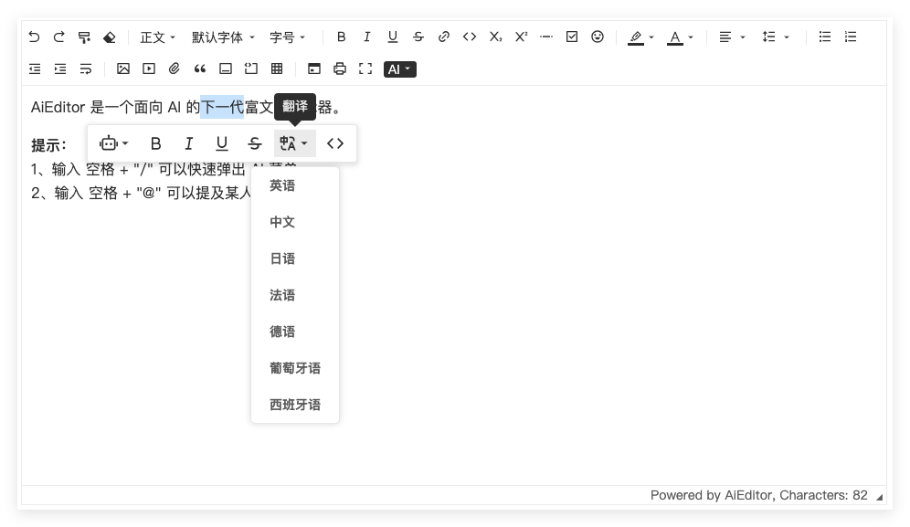

# AI 翻译功能配置

AI 翻译指的是选择一段文字后，可以对其内容进行翻译。如下图所示：



## 示例代码

如果我们需要对其默认翻译的语言进行配置， 配置代码如下：

```typescript
new AiEditor({
    element: "#aiEditor",
    ai: {
        translate: {
            prompt: (lang, selectedText) => {
                return `请帮我把以下内容翻译为: ${lang}，并返回翻译结果。 您需要翻译的内容是：\n${selectedText}`
            },
            translateMenuItems: [
                {title: '英语', language:'英语'},
                {title: '中文'},
                {title: '日语'},
                {title: '法语'},
                {title: '德语'},
                {title: '葡萄牙语'},
                {title: '西班牙语'},
            ],
        }
    },
})
```

- **prompt**: 大模型的 prompt 内容
- **translateMenuItem - title**: 用于在菜单显示的内容
- **translateMenuItem - language**: 传给 `prompt()` 方法的 `lang` 的值，当不配置的时候，默认使用 `title` 的值。