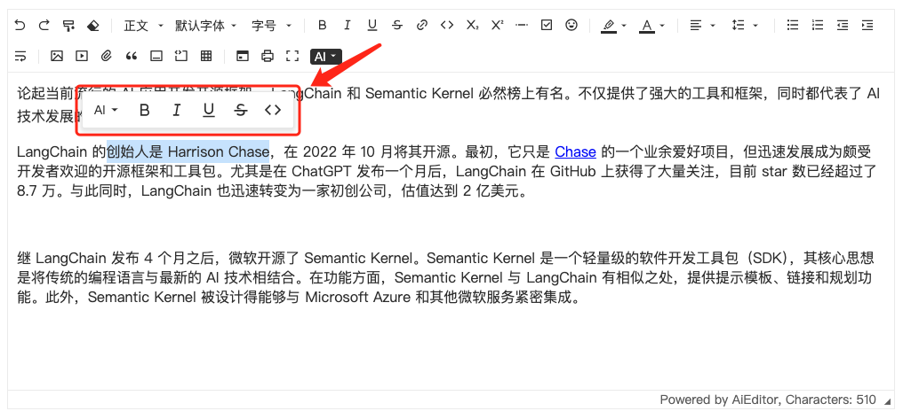

# 浮动菜单

浮动菜单指的是当用户选择一段文字时，弹出的 UI 菜单，如下图所示：


## 菜单配置

在 AIEditor 中，我们可以通过 `textSelectionBubbleMenu` 来配置浮动菜单，示例代码如下：

```typescript
new AiEditor({
    element: "#aiEditor",
    placeholder: "点击输入内容...",
    content: 'AiEditor 是一个面向 AI 的开源富文本编辑器。 ',
    textSelectionBubbleMenu: {
        enable: true,
        items: ["ai", "Bold", "Italic", "Underline", "Strike", "code", "comment"],
    },
})
```

- **enable**： 是否启用
- **items**： 浮动菜单的菜单项（配置不区分大小写）

> 注意：以上 **items** 的 "comment" 的配置，只有 Pro 版本支持（开源版暂不支持）。


## 自定义浮动菜单

可以通过以上 **items**，只需要传入一个 `BubbleMenuItem` 配置即可，示例代码如下：

```ts
new AiEditor({
    element: "#aiEditor",
    placeholder: "点击输入内容...",
    content: 'AiEditor 是一个面向 AI 的开源富文本编辑器。 ',
    textSelectionBubbleMenu: {
        enable: true,
        items: ["ai", "Bold", "Italic", {
            id: "visit",
            title: "visit-link",
            icon: "<svg xmlns=\"http://www.w3.org/2000/svg\" viewBox=\"0 0 24 24\"><path d=\"M10 6V8H5V19H16V14H18V20C18 20.5523 17.5523 21 17 21H4C3.44772 21 3 20.5523 3 20V7C3 6.44772 3.44772 6 4 6H10ZM21 3V11H19L18.9999 6.413L11.2071 14.2071L9.79289 12.7929L17.5849 5H13V3H21Z\"></path></svg>",
            onClick: (editor) => {
                window.open("https://aieditor.dev", "_blank")
            }
        }],
    },
})
```

`BubbleMenuItem` 配置说明：
- **id**:  当前菜单项的 ID，全局唯一，
- **title**:  当鼠标移动上去显示的标题，支持国际化配置。国际化配置参考 [国际化](./i18n.md) 章节。
- **icon**: 菜单项的 icon 或者 html 内容。 icon 建议使用 https://remixicon.com 下的图标，已和 AIEditor 保持一致。
- **onClick**: 监听点击事件

## AI 浮动菜单 💪

AI 浮动菜单只有在 `商业Pro版` 本中进行支持，点击配置的浮动菜单后，直接弹出 AI 对话内容。

其配置如下：

```ts
new AiEditor({
    element: "#aiEditor",
    placeholder: "点击输入内容...",
    content: 'AiEditor 是一个面向 AI 的开源富文本编辑器。 ',
    textSelectionBubbleMenu: {
        enable: true,
        items: ["ai", "Bold", "Italic", {
            id:"translate",
            icon:"<svg ....></svg>   ",
            type:"ai",
            prompt:"帮我翻译以下内容为英文： {content} "
        }],
    },
})
```
> 注意：以上配置中，`type: "ai"` 为固定值，不能修改为其他内容，否则会和 `自定义浮动菜单` 冲突。
