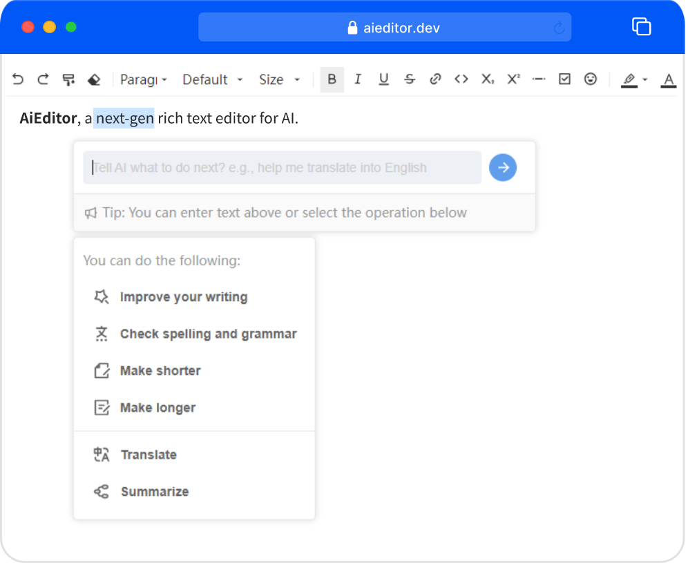

<h4 align="right"><strong>English</strong> | <a href="./readme.zh.md">简体中文</a> | <a href="./readme.ja.md">日本語</a></h4>

<h1 align="center"><a href="https://aieditor.dev" target="_blank">AIEditor.dev</a></h1>
<h2 align="center">An AI-Powered rich text editor</h2>
<h4 align="center">Out-of-the-box, Fully Framework Supported, Markdown Friendly</h4>

## Start following and using AIEditor

Give us a star so that you can be notified in time when we release new versions.

## What is AIEditor

AiEditor is a next-generation rich text editor for AI. It is based on Web Component and supports almost any front-end framework such as Vue, React, Angular, etc. It is compatible with PC Web
and mobiles, and provides two themes: light and dark. In addition, it also provides flexible configuration, and developers can easily use it to develop any text editing application.

For more information about AiEditor, please visit the official website: https://aieditor.dev

## What makes AIEditor different

### 1. AI-Powered editor
The goal of AIEditor is to create a rich text editor that is completely driven by AI, and supports docking with any large model, including private large models. Allow users to use their own private large model ApiKey.
Not only that, all AI functions of AIEditor allow users to customize their own prompts and extended AI menus.

### 2. Simple, friendly, and easy to use

AIEditor is developed based on Web Component and supports integration with any mainstream front-end framework. AIEditor uses the more friendly LGPL open source protocol and is used through `npm i aieditor`,
without worrying about the GPL infection problem that may be caused by the GPL protocol.

### 3. In addition to the open source version, a commercial version is also available
In addition to the open source version, we also provide a more powerful commercial version, which does not limit the number of users or the number of applications. For more comparisons of commercial versions,
please refer to here: https://aieditor.dev/price

## Online Demo

- Classic/traditional style: https://aieditor.dev/demo
- Modern style: http://doc.aieditor.com.cn

## Completed

- [x] **Basics**: Title, body, font, font size, bold, italic, underline, strikethrough, link, inline code, superscript, subscript, dividing line, quote, print
- [x] **Enhanced**: Undo, Redo, Format brush, Eraser, To-do list, font color, background color, Emoji expression, alignment, line height, ordered (unordered) list, paragraph indent, forced line break
- [x] **Attachment**: Supports image, video, file functions, supports select upload, paste upload, drag upload, support drag resize...
- [x] **Code**: Inline code, code block, language type selection, **AI automatic comment**, **AI code explanation**...
- [x] **Table**: Left increase right increase, left decrease right decrease, top increase and bottom increase, top decrease and bottom decrease, merge cells, unmerge
- [x] **Markdown**: Title, quote, table, image, code block, **Highlight block (similar to vuepress :::)**, various lists, bold, italic, strikethrough...
- [x] **AI**: AI continuation, AI optimization, AI proofreading, AI translation, custom AI menu and prompts
- [x] **More**: internationalization, light theme, dark theme, mobile phone adaptation, full screen editing, @XXX (mention)...
- [x] Modern UI style similar to Tencent Documents

## Commercial version
- [x] Notion-like content block dragging function
- [x] Word import, Word export
- [x] PDF export
- [x] Latex mathematical formula editing
- [x] Team collaboration (multiple people editing a document at the same time)
- [x] Annotation function, similar to the function of selecting a paragraph of text to annotate and comment on it in Word

## Under development...

- [ ] AI image insertion (AI text-to-image)
- [ ] AI image generation (AI image-to-image)
- [ ] AI one-click typesetting
- [ ] Further enhance the paste function
- [ ] Automatically obtain thumbnails when uploading videos

## Quick start

Visit the official website: https://aieditor.dev
