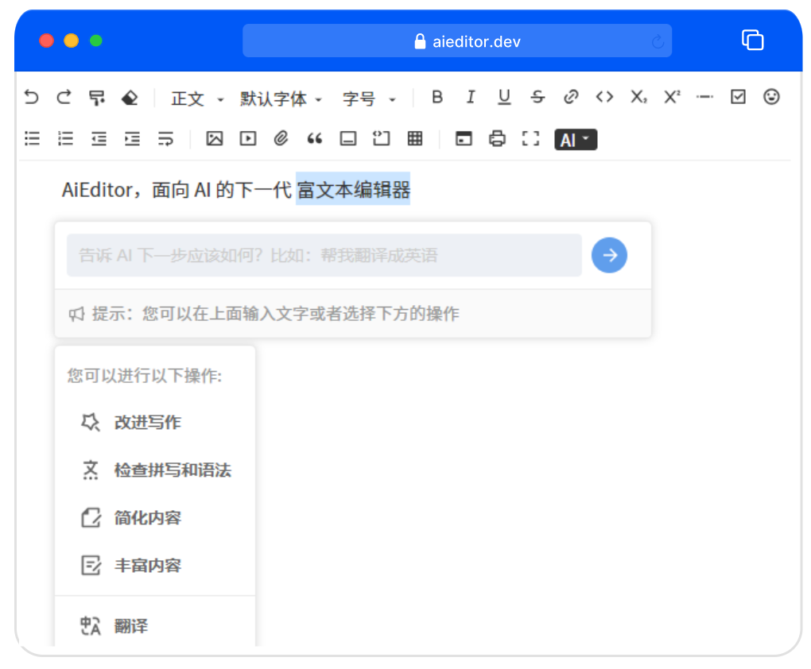
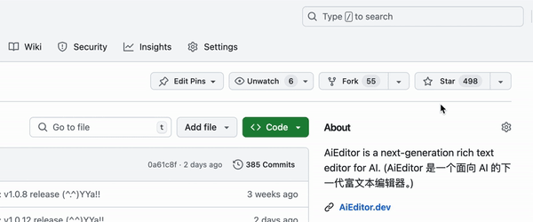

<h4 align="right"><a href="./readme.md">English</a> | <strong>简体中文</strong> | <a href="./readme.ja.md">日本語</a></h4>

<h1 align="center"><a href="https://aieditor.dev/zh/" target="_blank">AIEditor.dev</a></h1>
<h4 align="center"></h4>

<h2 align="center">AI 驱动的开源富文本编辑器</h2>
<h3 align="center">开箱即用、支持所有前端框架、支持 Markdown 书写模式</h4>

## 开始关注并使用 AIEditor

给我们 star，这样，在我们发布新的版本时，您可以及时获得通知。

## 什么是 AIEditor

AiEditor 是一个面向 AI 的下一代富文本编辑器，她基于 Web Component，因此支持 Layui、Vue、React、Angular 等几乎任何前端框架。她适配了 PC Web 
端和手机端，并提供了 亮色 和 暗色 两个主题。除此之外，她还提供了灵活的配置，开发者可以方便的使用其开发任何文字编辑的应用。

更多关于 AiEditor，请访问官网： https://aieditor.com.cn

## AIEditor 的与众不同之处

### 1、AI 驱动的编辑器
AIEditor 的目标是打造一个完全由 AI 驱动的富文本编辑器，同时支持对接任意大模型，包括私有的大模型。允许用户使用自己私有的大模型 ApiKey。
不仅如此，AIEditor 其所有的 AI 功能，都允许用户自定义自己的 prompt，以及扩展的 AI 菜单。

### 2、简单、友好、易用

AIEditor 基于 Web Component 开发，支持与任意主流的前端框架集成。AIEditor 使用更加友好的 LGPL 开源协议，通过 `npm i aieditor` 使用，
不用担心 GPL 协议可能带来的 GPL 传染问题。

### 3、除了开源版，还提供商业 Pro 版
除了开源版以外，我们还提供了功能更加强大的商业，商业 Pro 版不限制用户量、不限制应用数量。更多商业 Pro 版的对比，
可以参考这里：https://aieditor.com.cn/zh/price

## 在线演示

- 现代风格（类腾讯文档）: http://doc.aieditor.com.cn
- 经典/传统风格: https://aieditor.com.cn/zh/demo

## 已完善

- [x] **基础**：标题、正文、字体、字号、加粗、斜体、下划线、删除线、链接、行内代码、上标、下标、分割线、引用、打印
- [x] **增强**：撤回、重做、格式刷、橡皮擦、待办事项、字体颜色、背景颜色、Emoji 表情、对齐方式、行高、有（无）序列表、段落缩进、强制换行
- [x] **附件**：支持图片、视频、文件功能，支持选择上传、粘贴上传、拖拽上传、支持拖动调整大小...
- [x] **代码**：行内代码、代码块、语言类型选择、**AI 自动注释**、**AI 代码解释**...
- [x] **表格**：左增右增、左减右减、上增下增、上减下减、合并单元格、解除合并
- [x] **Markdown**：标题、引用、表格、图片、代码块、**高亮块（类似 vuepress 的 :::）**、各种列表、粗体、斜体、删除线...
- [x] **A I**：AI 续写、AI 优化、AI 校对、AI 翻译、自定义 AI 菜单及其 Prompts
- [x] **更多**：国际化、亮色主题、暗色主题、手机适配、全屏编辑、@某某某（提及）...
- [x] 类腾讯文档现代 UI 风格

## 商业 Pro 版
- [x] 类 Notion 内容块拖拽功能
- [x] Word 导入、Word 导出
- [x] PDF 导出
- [x] Latex 数学公式编辑
- [x] 团队协作（多个人同时编辑一份文档）
- [x] 批注功能，类似 word 选择一段文字进行批注评论的功能

商业 Pro 版演示：http://pro.aieditor.com.cn/

## 开发中...

- [ ] AI 插入图片
- [ ] AI 图生图（AI 图片优化）
- [ ] AI 一键排版
- [ ] 进一步增强粘贴功能
- [ ] 上传视频自动获取缩略图

## 快速开始

访问官网：https://aieditor.com.cn

## 交流

QQ 群：560291578

